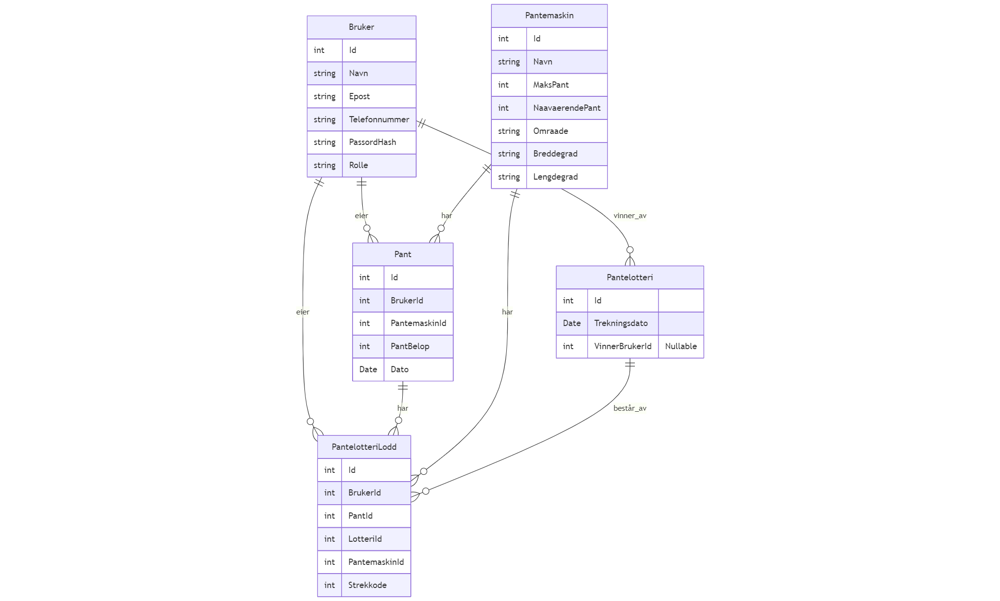

# Utvikling Oppgave Pantelotteriet

I denne oppgaven har jeg laget en full-stack web applikasjon med:
- PostreSQL 
- Dotnet Core Backend
- NextJS Frontend

Og kontainerisert hele applikasjonen.


### Tech stack til prosjektet:


## Hvordan kjøre

Kjør med Docker: <br>
(Dette krever at docker engine kjøres på PC)
```bash
# klon git repository
git clone https://github.com/HermanErKu/utvikling-oppgave2-pantelotteriet

# kjør hele applikasjonen med docker compose
docker compose up --build
```


Applikasjonene blir da kjørt slik:
| Applikasjon | Docker Image | Port | Beskrivelse |
| --- | --- | --- | ------ |
| PostgreSQL | postgres | 5432 | Database til prosjektet |
| Backend | Backend/Dockerfile | 5000 | Dotnet Backend API |
| Frontend | Frontend/Dockerfile | 3000 | NextJS Frontend Nettside |


## Kontainerisering
Jeg har kontainerisert denne applikasjonen med Docker.

## Database
Postgresql




## Backend
Dotnet EF Core

## Frontend
NextJS