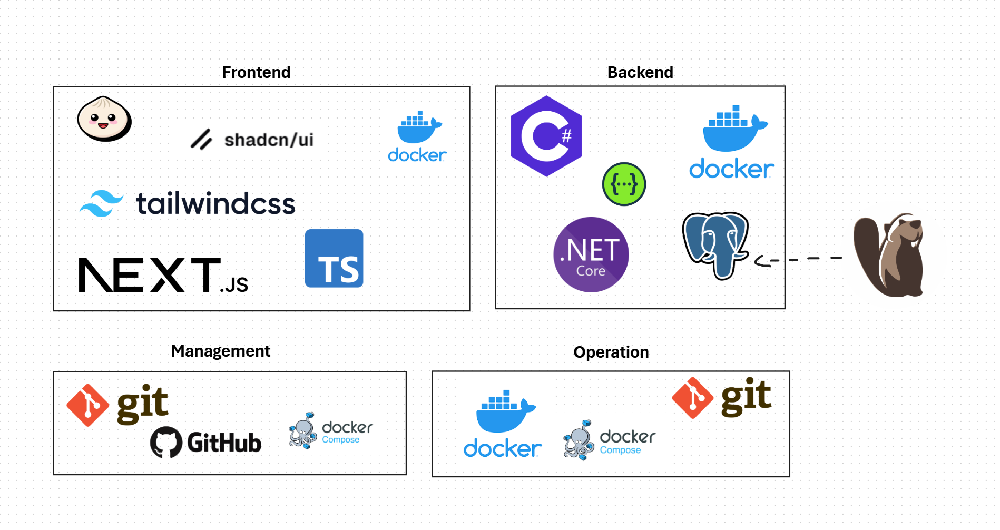
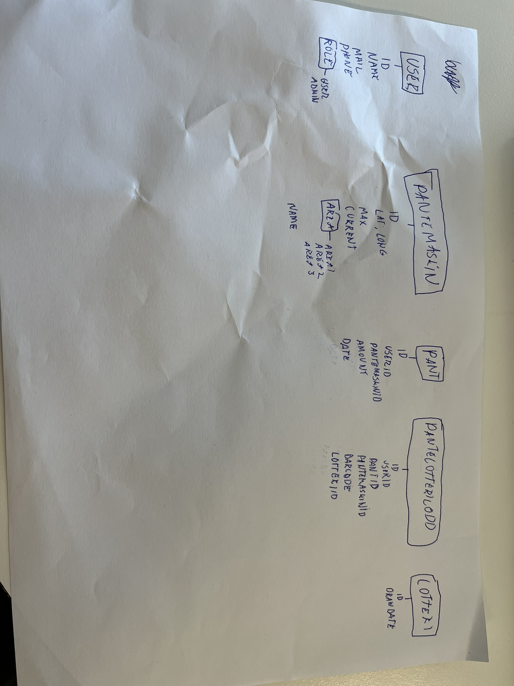

# Utvikling Oppgave Pantelotteriet

Denne oppgaven handlet om å lage et system for resirkulering og panting med et pantelotteri. Jeg har da laget et full-stack applikasjon ved bruk av relevante verktøy for å gjennomføre oppgaven.


I denne oppgaven har jeg laget, og kontainerisert, en full-stack web applikasjon med:
- [PostgreSQL](https://www.postgresql.org/) Database
- [Dotnet Core](https://dotnet.microsoft.com/en-us/) Backend
- [NextJS](https://nextjs.org/) Frontend
- [Docker](https://www.docker.com/)


### Tech stack til prosjektet:
Før jeg startet prosjektet, satt jeg opp denne tech-stacken som jeg ville forholde meg til. Dette pleier jeg å gjøre slik at jeg på forhånd vet hva jeg må sette opp og hva jeg skal bruke.




## Hvordan kjøre

Kjør med Docker: <br>
(Dette krever at docker engine kjøres på PC)
```bash
# klon git repository
git clone https://github.com/HermanErKu/utvikling-oppgave2-pantelotteriet

# kjør hele applikasjonen med docker compose
docker compose up --build
```


Applikasjonene blir da kjørt slik:
| Applikasjon | Docker Image | Port | Beskrivelse |
| --- | --- | --- | ------ |
| PostgreSQL | postgres | 5432 | Database til prosjektet |
| Backend | Backend/Dockerfile | 5000 | Dotnet Backend API |
| Frontend | Frontend/Dockerfile | 3000 | NextJS Frontend Nettside |

Det eneste som er nødvendig å besøke er http://localhost:3000 der frontend applikasjonen vil ligge. Denne er koblet opp mot backend som videre er koblet mot databasen.

Hvis intressert, ligger backend Swagger dokumentasjon på: http://localhost:5000/swagger/index.html


## Kontainerisering
Jeg har kontainerisert hele applikasjonen med Docker. For å manage Docker imagene, har jeg brukt [docker-compose](https://github.com/HermanErKu/utvikling-oppgave2-pantelotteriet/blob/main/docker-compose.yml):

#### Database
Her har jeg brukt postgres offisielle Docker image og kun lagt til noen attributter i [docker-compose filen](https://github.com/HermanErKu/utvikling-oppgave2-pantelotteriet/blob/main/docker-compose.yml#L2). Her har jeg f. eks. satt brukernavn og passord til databasen, og valgt at porten skal være åpen ut slik at de andre applikasjonene kan bruke databasen.

#### Frontend
Til frontend applikasjonen har jeg skrevet min egen [Dockerfile](https://github.com/HermanErKu/utvikling-oppgave2-pantelotteriet/blob/main/Frontend/Dockerfile). Her har jeg brukt [bun](https://bun.sh/) som package manager over npm siden denne fungerer litt raskere, noe som er smart når man skal kontainerisere applikasjonen. Jeg har så importert docker imaget inn i [docker-compose](https://github.com/HermanErKu/utvikling-oppgave2-pantelotteriet/blob/main/docker-compose.yml#L26) filen.

#### Backend
Jeg har også skrevet min egen [Dockerfile](https://github.com/HermanErKu/utvikling-oppgave2-pantelotteriet/blob/main/Backend/Dockerfile) til backend applikasjonen. Her har jeg brukt mye av microsoft sin eksempel og standard kode i Dockerfilen for å lage et optimalt Docker image siden jeg ikke har jobbet så mye med dotnet tidligere. Jeg importerte også dette imaget inn i [docker-compose](https://github.com/HermanErKu/utvikling-oppgave2-pantelotteriet/blob/main/docker-compose.yml#L13) filen.


## Database
Jeg visste fra starten av at jeg ville bruke PostgreSQL som databaseløsning. Dette er en standard som er mye brukt og som jeg er kjent med.

Det første jeg gjorde var at jeg skisset opp en rask databasemodell på et ark. Jeg synes dette er lurt når jeg videre skal definere databasen i et ORM og det fort blir kluss med klasser, enumer og datatyper som er litt overalt.



Her har jeg satt opp databasen som mermaidcode og tatt et skjermbilde for å vise bedre hvordan databasen er satt opp og hvordan relasjonene fungerer med hverandre.


Siden jeg brukte Dotnet Entity Framework Core, som er et ORM, trengte jeg aldri å kjøre SQL direkte inn mot databasen. Jeg liker likevel å ha muligheten til å gjøre dette for å se at alt stemmer i databasen. Jeg har derfor brukt [DBeaver](https://dbeaver.io/) som gir meg muligheten til å kjøre SQL calls mot databaser.


## Backend
Dotnet EF Core

## Frontend
NextJS